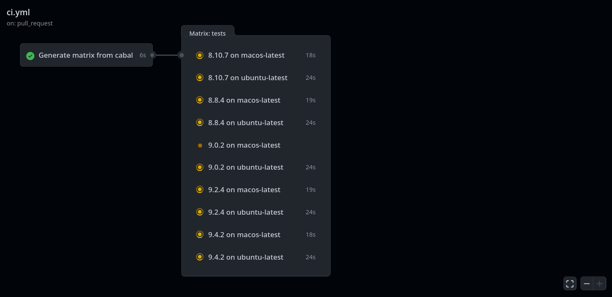

# get-tested

A CLI tool that retrieves the `tested-with` stanza of a cabal file and formats it in such a way that GitHub Actions can use it.

## Usage

The inputs of the action (under the `with:` stanza) are the following:

*  cabal-file:
    The path to your cabal file, e.g. somefolder/myproject.cabal. required;
*  version: Version of the tool. required;
*  windows: (legacy) Enable Windows runner, latest version. required: false, default: false;
*  windows-version: Enable Windows runner. If both `windows` and `windows-version` inputs are set, the explicit version will take priority. required: false, default: "";
*  macos: (legacy) Enable macOS runner, latest version. required: false, default: false;
*  macos-version: Enable macOS runner.  If both `macos` and `macos-version` inputs are set, the explicit version will take priority. required: false, default: "";
*  ubuntu: (legacy) Enable Ubuntu runner, latest version. required: false, default: false;
*  ubuntu-version: Enable Ubuntu runner.  If both `ubuntu` and `ubuntu-version` inputs are set, the explicit version will take priority. required: false, default: "".

See below for an example:

```yaml
jobs:
  generate-matrix:
    name: "Generate matrix from cabal"
    outputs: 
      matrix: ${{ steps.set-matrix.outputs.matrix }}
    runs-on: ubuntu-latest
    steps:
      - name: Extract the tested GHC versions
        id: set-matrix
        uses: kleidukos/get-tested@v0.1.7.0
        with:
          cabal-file: get-tested.cabal
          ubuntu-version: "latest"
          macos-version: "13"
          version: 0.1.7.0
  tests:
    name: ${{ matrix.ghc }} on ${{ matrix.os }}
    needs: generate-matrix
    runs-on: ${{ matrix.os }}
    strategy:
      matrix: ${{ fromJSON(needs.generate-matrix.outputs.matrix) }}
```


