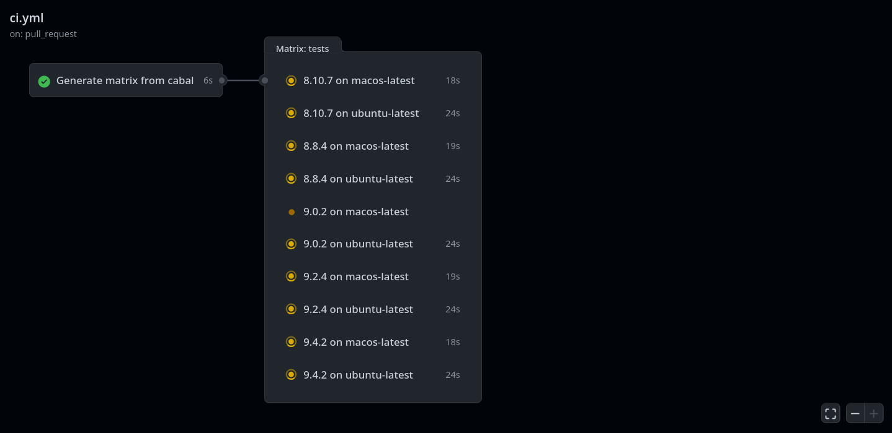

# get-tested

A CLI tool that retrieves the `tested-with` stanza of a cabal file and formats
it in such a way that GitHub Actions can use it.

## Usage

The inputs of the action (under the `with:` stanza) are the following:

| Input | Description | Default |
|---|---|---|
| `cabal-file` | **Required.** The path to your cabal file, e.g. `somefolder/myproject.cabal`. | |
| `version` | The version of the get-tested tool that is used. | The latest release |
| `ubuntu-version` | Enable the Ubuntu runner with these versions, comma separated, e.g. `"latest, 22.04"`. | Not set |
| `macos-version` | Enable the macOS runner with these versions, comma separated. | Not set |
| `windows-version` | Enable the Windows runner with these versions, comma separated. | Not set |
| `newest` | Enable only the newest GHC version found in the cabal file. | `false` |
| `oldest` | Enable only the oldest GHC version found in the cabal file. | `false` |
| `versions-only` | Return only the list of GHC versions, e.g. `["9.12.2","9.14.1"]`, instead of a full matrix. The runner inputs are ignored, so you write the rest of the matrix yourself. Requires get-tested 0.1.10.0 or later. | `false` |

Unless `versions-only` is set, you **must** enable at least one runner, with one of the `*-version` inputs or one of the deprecated inputs below.

**Deprecated:** `ubuntu`, `macos` and `windows` (default `false`) enable the latest version of that runner when set to `true`. Use `ubuntu-version: "latest"` and so on instead. If both a deprecated input and its `*-version` input are set, the version input takes priority.

See below for an example:

```yaml
jobs:
  generate-matrix:
    name: "Generate matrix from cabal"
    outputs:
      matrix: ${{ steps.set-matrix.outputs.matrix }}
    runs-on: ubuntu-latest
    steps:
      - name: Extract the tested GHC versions
        id: set-matrix
        uses: kleidukos/get-tested@v0.1.10.0
        with:
          cabal-file: get-tested.cabal
          ubuntu-version: "latest"
          macos-version: "latest"
          version: 0.1.10.0
  tests:
    name: ${{ matrix.ghc }} on ${{ matrix.os }}
    needs: generate-matrix
    runs-on: ${{ matrix.os }}
    strategy:
      matrix: ${{ fromJSON(needs.generate-matrix.outputs.matrix) }}
```



If you want to build the matrix yourself, for example to add your own `include`
or `exclude` entries, use `versions-only` and read the GHC versions from the
output:

```yaml
jobs:
  generate-matrix:
    name: "Generate matrix from cabal"
    outputs:
      ghc: ${{ steps.set-matrix.outputs.matrix }}
    runs-on: ubuntu-latest
    steps:
      - name: Extract the tested GHC versions
        id: set-matrix
        uses: kleidukos/get-tested@v0.1.10.0
        with:
          cabal-file: get-tested.cabal
          versions-only: true
          version: 0.1.10.0
  tests:
    name: ${{ matrix.ghc }} on ${{ matrix.os }}
    needs: generate-matrix
    runs-on: ${{ matrix.os }}
    strategy:
      matrix:
        ghc: ${{ fromJSON(needs.generate-matrix.outputs.ghc) }}
        os: [ubuntu-latest, macos-latest]
```
